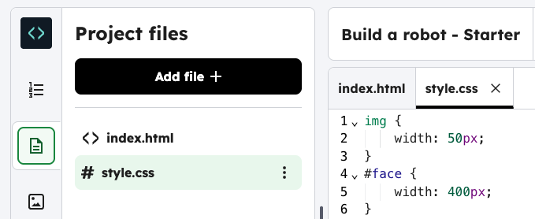
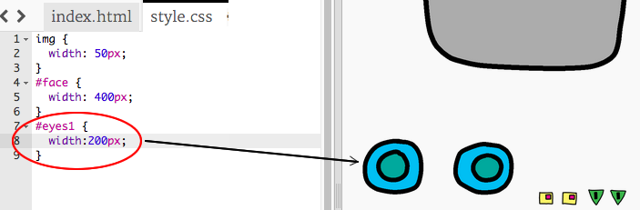

<h2 class="c-project-heading--task">Give your robot eyes</h2>

Choose an image and use the `id` to style it.

<h2 class="c-project-heading--explainer">Follow these instructions</h2>

## Step 1

Click on the `style.css` file, 

## Step 2

Add the CSS code below to style the robot eyes.

## Step 3

Experiment with `width` to make the eyes bigger or smaller.

## Step 4

Try adding different features. For example, you can use `#eyes2` or `#eyes3`.

--- code ---
---
language: css
filename: style.css
line_numbers: true
line_number_start: 4
line_highlights: 7-9
---
#face {
	width: 400px;
}
#eyes1 {
    width: 400px;
    }

--- /code ---

## Step 5

**Run** to test. Scroll down to see the eyes change size. 

### Tip

Each image in this project has its own name (or `id`). For example, `` or ``. This allows you to style each image separately.

## Now run your code

Run your code and check that the robot’s eyes change size when you scroll down.
