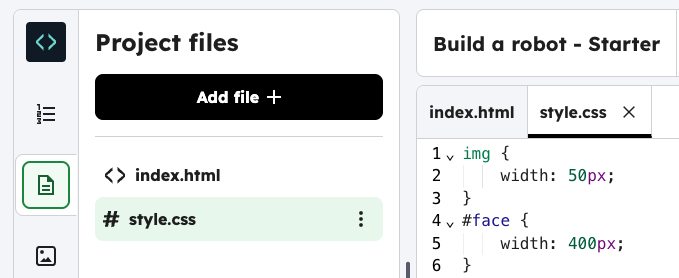

<h2 class="c-project-heading--task">Give your robot eyes</h2>

--- task ---

Choose an image and use the `id` to style it.

--- /task ---

--- task ---

Click on the `style.css` file, 

--- /task ---

--- task ---

Add the CSS code below to style the robot eyes.

--- /task ---

--- code ---
---
language: css
filename: style.css
line_numbers: true
line_number_start: 4
line_highlights: 7-9
---
#face {
	width: 400px;
}
#eyes1 {
    width: 400px;
    }

--- /code ---

--- task ---

**Run** to test. Scroll down to see the eyes change size. Experiment with `width` to make the eyes bigger or smaller.

--- /task ---

### Tip

Each image in this project has its own name (or `id`). For example, `` or ``. This allows you to style each image separately.

