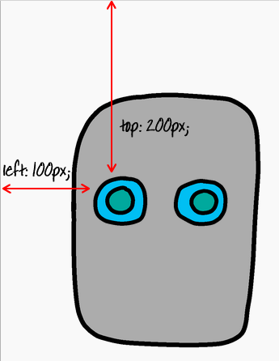

<h2 class="c-project-heading--task">Position the eyes</h2>

Add the CSS code to position your eyes onto your robot face.

--- code ---
---
language: css
filename: style.css
line_numbers: true
line_number_start: 7
line_highlights: 9-11
---
#eyes1 {
    width: 200px;
    position: absolute;
    top: 200px;
    left: 100px;
    }
    
--- /code ---

## Now run your code

Run your code and check that the robot’s eyes move to the new position. Experiment until you get the eyes where you want them. 

### Tip

You can use `bottom` instead of `top` to tell the browser how far from the bottom of the screen to show the image, as well as `right` instead of `left`.

