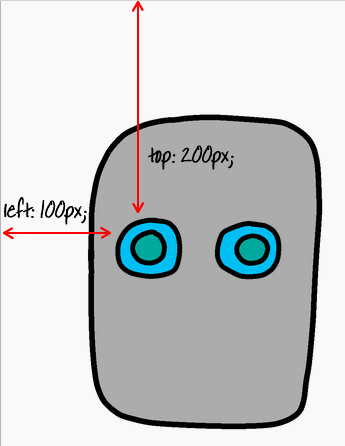

## Position the eyes

Add the CSS code to position your eyes onto your robot face.

```css filename="style.css" line_numbers="true" line_number_start="7" line_highlights="9-11"
#eyes1 {
    width: 200px;
    position: absolute;
    top: 200px;
    left: 100px;
    }
    
```

## Now run your code

Run your code and check that the robot’s eyes move to the new position. Experiment until you get the eyes where you want them.



> [!TIP]
>
> You can use `bottom` instead of `top` to tell the browser how far from the bottom of the screen to show the image, as well as `right` instead of `left`.
