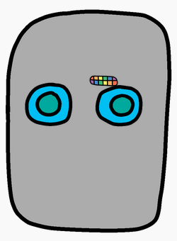

<h2 class="c-project-heading--task">Give your robot a mouth</h2>

### Step 1

Add CSS code to style your `mouth1` image.

### Step 2

Add the code below to your project.

### Step 3

The code makes the robot’s mouth look small, and in the wrong place! Style the mouth by changing the `width`, `top` and `left` positions of `mouth1` in `style.css`. 

--- code ---
---
language: css
filename: style.css
line_numbers: true
line_number_start: 10
line_highlights: 13-18
---
    top: 200px;
    left: 100px;
    }
#mouth1 {
    width: 50px;
    position: absolute;
    top: 200px;
    left: 200px;
    }
    
--- /code ---

### Step 4

**Run** to test. Try different values until the robot looks the way you want. 

