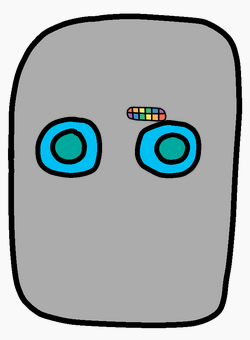

## Give your robot a mouth

Add CSS code to style your `mouth1` image.

## Step 1

Add the code below to your project.

```css filename="style.css" line_numbers="true" line_number_start="10" line_highlights="13-18"
    top: 200px;
    left: 100px;
    }
#mouth1 {
    width: 50px;
    position: absolute;
    top: 200px;
    left: 200px;
    }
    
```

## Step 2

The code makes the robot’s mouth look small, and in the wrong place! Style the mouth by changing the `width`, `top` and `left` positions of `mouth1` in `style.css`.

## Now run your code

Run your code and check that the mouth moves to the position you set. Try different values until the robot looks the way you want.


