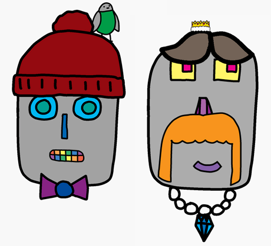

## Challenge

Make your own robot design.

> [!CHALLENGE]
>
> ## Keep designing
>
> Use what you’ve learnt to finish designing your own robot. Here are some examples of how your robot might look:
>
> 

> [!CHALLENGE]
>
> ## Accessorise
>
> What else can you add? Accessorise with jewellery or different hairstyles.

> [!CHALLENGE]
>
> ## Make a second robot
>
> Make a second robot with different parts from the image gallery.
