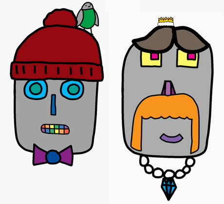

<h2 class="c-project-heading--task">Challenge</h2>

--- task ---

Make your own robot design.

--- /task ---

--- task ---

Use what you’ve learnt to finish designing your own robot. Here are some examples of how your robot might look:

--- /task ---

--- task ---

What else can you add? Accessorise with jewelry or different hairstyles.

--- /task ---

--- task ---

Make a second robot with different parts from the image gallery.

--- /task ---